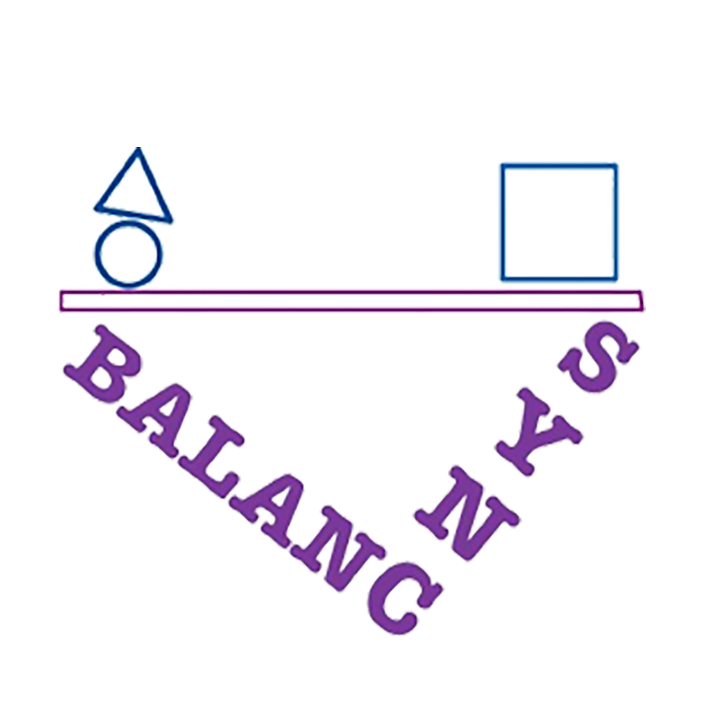
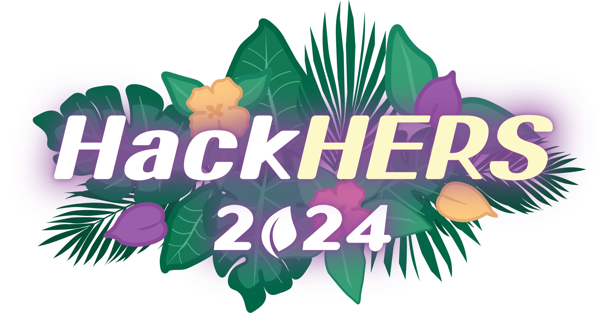

<link rel="preconnect" href="https://fonts.googleapis.com">
<link rel="preconnect" href="https://fonts.gstatic.com" crossorigin>
<link href="https://fonts.googleapis.com/css2?family=Crimson+Pro&family=Literata" rel="stylesheet">

<div align=center>


<div style="text-align: center; background: ; width:300px;">
    
<h1 style="color:black;font-family:'Times New Roman'">BalanSync</h1>
</div>

</div>

**Tool handles organization of events and also does recommendation through general AI applications.**

<p align="center">
<i>Built for HackHers Spring 2024</i>
<p>



<div align="center">

## How to install

</div>

Follow these steps to set up the environment and run the application.
1. If you are *not* an author, fork the repository [here](https://github.com/koolkusum/HackHers-2024/fork).
2. Clone the repository.
```bash
    git clone https://github.com/koolkusum/HackHers-2024.git
```
3. Create the python virtual environment.
- Either use vscode or using [virtualenv](https://learnpython.com/blog/how-to-use-virtualenv-python/):
```bash
virtual env 
```
- **OR**
```bash
python -m venv env
```
4. Activate the Virtual Environment (Not necessary for vscode).

- On Windows.

```bash
env\Scripts\activate
```

- On macOS and Linux.

```bash
source env/bin/activate
```

5. Install Dependencies
- Make sure your pip version is up-to-date:
```bash
pip install --upgrade pip
```
```bash
pip install --upgrade google-api-python-client google-auth-httplib2 google-auth-oauthlib
pip install -r requirements.txt
```


6. Run the app
```bash
cd flask
python -m flask run
```

### Technologies
- Flask
- Python
- Google Calendar API
- Gemini API
- Bootstrap
- JavaScript
- SQL
